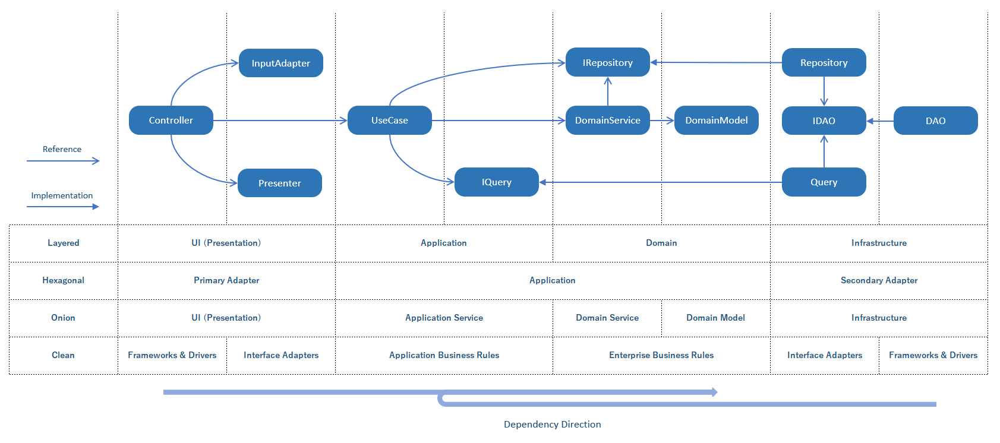

# ArchitectureSample

## はじめに

システムのソフトウェアアーキテクチャにおいてDDDのアプローチはよく知られています。  
いわゆるエヴァンスのDDDにおけるレイヤードアーキテクチャを始めとして、ヘキサゴナルアーキテクチャ、オニオンアーキテクチャ、クリーンアーキテクチャなど、派生するアーキテクチャがいくつか存在します。  

これらのアーキテクチャにおいて「関心の分離」という考え方は共通しています。  
また、エヴァンス本におけるレイヤードアーキテクチャの時点では提唱されていなかったものの、後にDIP（依存性逆転の法則）を適用することで「依存性のルール」が確立され、以降のアーキテクチャにも引き継がれています。

これらの考え方によって各アーキテクチャは「本質的には同じ」と言われることがありますが、一方でそれぞれのアーキテクチャにおけるサンプルプログラムにおいては違いが見られ、何をもって「本質的に同じ」と言わしめているかが分かりづらい面があります。

このリポジトリでは、これらのアーキテクチャのどれにでも当てはめることができるシンプルなプログラムを作成し、それぞれのアーキテクチャにおいてのどのレイヤーと対応するかを比較しています。

## 図

## 各機能の説明

オブジェクト指向言語における各クラスの役割です。  
クラスを用いない言語においては関数と読み替えても基本的に問題ないかと思います。

### Controller

* 型：Parameter → Controller → ViewModel
* 依存：InputAdapter・UseCase・Presenter

Controllerは「Frameworks & Drivers」層からデータを受け取ってUseCaseに渡す役割を持ちます。  
しかし、MVCフレームワークにおいてはフレームワーク側に組み込まれてモデルバインディングなどを行うこともできるため、ASP.NET Coreを使った今回のサンプルでは「Frameworks & Drivers」層に置いています。  

フレームワークから独立する場合には、クリーンアーキテクチャの原著における定義の通り、「InterFace Adapters」層に置いて良いかと思います。

### InputAdapter

* 型：Request → InputAdapter → InputData
* 依存：なし

InputAdapterはUseCaseに渡すデータであるInputDataを作成する役割を持ちます。  
名前はMapperでもConverterでも良いかもしれないですが、なんとなくAdapterにしてみました。  

今回のサンプルでは「Presentation」層としているので特に区別していませんが、「Frameworks & Drivers」と「InterFace Adapters」層を分離する場合には、HttpRequestからパラメタを取得するような処理は依存性の向きが違反するため、インタフェースを切るような形にしたほうが良いかもしれません。

### UseCase

* 型：InputData → UseCase → OutputData
* 依存：DomainService・Repository(インタフェース)・Query(インタフェース)

UseCaseは名前の通り、この処理（ユースケース）におけるメインの処理を行うクラスです。  
実際の処理は「Domain」層や「Infrastructure」層に委譲することが多いですが、やりたいことや処理の流れを制御する役割を持ち、ワークフロー的な書き方をすることもあります。  

処理の内容が複雑な場合はApplicationServiceやSubUseCaseといった形で分割するのも良いです。  
その場合にはUseCaseと同じレイヤーに置きます。

### Presenter

* 型：OutputData → Presenter → ViewModel
* 依存：なし

PresenterはUseCaseから受け取ったデータをViewModelに変換します。  
UseCaseがアプリケーションとしてのデータを取得し、Presenterがレスポンス用に加工するという役割分担です。

InputAdapterと対応するのですが、Presenterの入力側にした場合の名前が思い浮かばなかったので対応関係がちょっと分かりづらいです。  
ViewModelは「Frameworks & Drivers」層に渡され、フレームワークによってレスポンスを返すことになります。

### Query(インタフェース)

* 型：任意 → IQuery → DTO
* 依存：なし（実体ではないので）

Queryはデータの取得を行うためのインタフェースです。  
依存性逆転のために「Application」層に置き、実装は「Infrastructure」層で行います。    

CQRSにおけるQueryに対応します。引数はDomainModelを利用しても構いませんが、プリミティブな値を利用しても構いません。  
戻り値のDTOはレスポンスとしてそのまま利用して問題ありません。

### Repository(インタフェース)

* 型（例）：DomainModel → IRepository → DomainModel　DomainModel → IRepository → void
* 依存：なし（実体ではないので）

Repositoryはデータの永続化を行うためのインタフェースです。  
依存性逆転のために「Domain」層に置き、実装は「Infrastructure」層で行います。  

CQRS（コマンドクエリ分離責務分離）を意識する場合は主にCommandに対応しますが、「Domain」層でのReadはあってもいいような気がします。  
もちろんCQRSを意識しない場合はQuery側も担ってしまっても問題はないです。

### DomainService

* 型（例）：DomainModel → DomainService → DomainModel　DomainModel → DomainService → void
* 依存：Repository(インタフェース)

DomainServiceは複数のDomainModelにまたがるビジネスロジックを表すためのものです。  
オニオンアーキテクチャにおいてはレイヤとして表現されますが、個人的には「Domain」層としてまとめてしまっても特に問題はないかと思います。

### DomainModel

* 型：なし（関数ではないので）
* 依存：なし（場合によってはDomainServiceのインタフェースを持っても良いかも？）

DomainModelはビジネスロジックを表すためのクラスで、値や状態と振る舞いをカプセル化します。  
EntityやValueObject、Aggregationといったクラスがこれに該当します。

他のクラスが（依存性を持つことはあっても）関数かデータ構造で表現されるのに対して、DomainModelはその両方の性質を兼ね備えた非常に「オブジェクト指向的な」クラスです。  
できる限りDomainModelを育てていくことが安定したアーキテクチャを構築するための重要なポイントです。

### Query(実装)

* 型：任意 → Query → DTO
* 依存：DAO(インタフェース)　またはDBコネクションやHttpClientなど

Queryの実装です。「Infrastructure」層に置かれます。  
サンプルにおいてはDAOを利用しているので「Interface Adapters」層になりますが、直接外部依存を持って「Frameworks & Drivers」層に置いても良いとは思います。  
GraphQLやgRPCなどとの相性も良さそうです。

### Repository(実装)

* 型（例）：DomainModel → Repository → DomainModel　DomainModel → Repository → void
* 依存：DAO(インタフェース)

Repositoryの実装です。「Infrastructure」層に置き、INもOUTもできるだけDomainModelを利用します。  
クリーンアーキテクチャにおけるレイヤとしては「Interface Adapters」層になります。

サンプルでは実際のデータベースアクセス等を行うDAOを利用することによって、外部依存をできるだけ外のレイヤーに押しやっています。  
アプリケーションのコアな型であるDomainModelと外部依存のためのDTOの型変換などを担い、ユニットテストを書くこともできます。

### DAO(インタフェース)

* 型：DTO → DAO → DTO　任意 → DAO → DTO
* 依存：なし（実体ではないので）

外部データ連携のためのインタフェースです。外部への依存を隠蔽します。  
RepositoryとQueryの両方で利用して問題ありません。ドメインモデルの型はここまで持ってこない方が良いかと思います。
データベースなどとのインピーダンスミスマッチはここで吸収してしまいましょう。

### DAO(実装)

* 型：DTO → DAO → DTO　任意 → DAO → DTO
* 依存：DBコネクションやHttpClientなど

外部データ連携のための実装です。外部への依存を一手に担うため、かなり外部依存するローレベルな処理をゴリゴリ書くことになります。  
このクラスにはユニットテストを書かなくて済むように、あまりロジックは書かないことをオススメします。